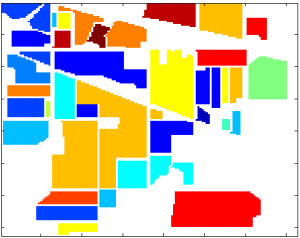
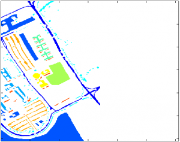

# Hyperspectral_Image_Datasets_Collection

## 选择语言
- [中文](#中文)
- [English](en/README.md)

## 中文

### 介绍
本仓库包含常用的高光谱图像数据集，供科研使用。数据集也可以在百度网盘上获取。

### 下载链接
- **百度网盘**: [全部数据连接](https://pan.baidu.com/s/13Bd_8vZT9pIfqbTxNYlyEw?pwd=v81w)

### 数据集
#### 1. 印度松树（IP）数据集
- **数据采集时间**: 1992年
- **原始链接**: [Indian Pines Dataset](http://www.ehu.eus/ccwintco/index.php?title=Hyperspectral_Remote_Sensing_Scenes#Indian_Pines)
- **描述**: 印度松树数据集是一个常用于高光谱图像处理的基准数据集，包含来自印第安纳州普渡大学实验农场的224个波段的高光谱图像。
- **像素大小**: 145 x 145
- **波段数**: 224(原始)/200(去除吸水波段)
- **类别总数**：16 [Details](data/Indian_Pines/Class_details.md)
- **GT(标签) 图像**

#### 2. 帕维亚大学（PU）数据集
- **数据采集时间**: 2001年
- **原始链接**: [Pavia University Dataset](http://www.ehu.eus/ccwintco/index.php?title=Hyperspectral_Remote_Sensing_Scenes#Pavia_Centre_and_University)
- **描述**: ROSIS传感器在意大利北部帕维亚上空飞行时拍摄的两个场景。
- **像素大小**: 610 x 610(大学)/610 x 340(去除黑色像素)
- **波段数**: 103
- **类别总数**：9 [Details](data/Pavia/Class_details.md)
- **GT 图像**: 

#### 3. 休斯顿大学（HU）数据集
- **数据采集时间**: 2013年
- **原始链接**: [Houston University Dataset](https://hyperspectral.ee.uh.edu/?page_id=459)
- **描述**: 休斯顿大学数据集用于IEEE GRSS数据融合竞赛，包含休斯顿市区的高光谱图像和相应的地面真实标签，用于评估分类算法。
- **像素大小**: 349 x 1905
- **波段数**: 144
- **GT 图像**: 

