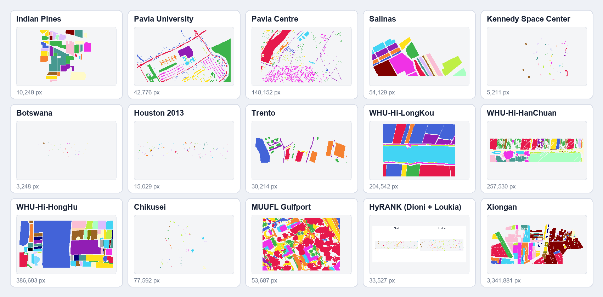
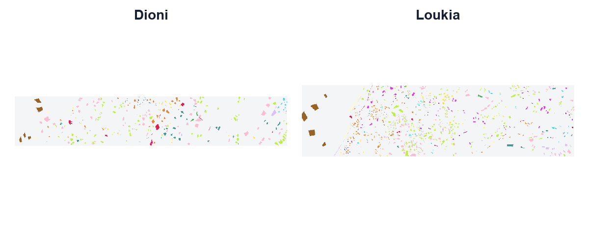
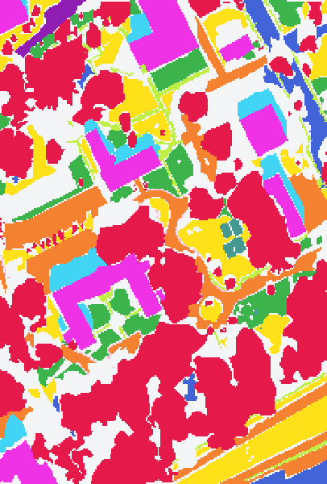
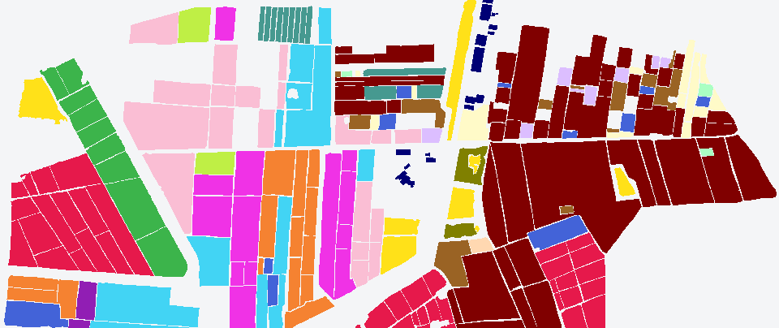

# Hyperspectral Image Datasets Collection

**15 个高光谱分类数据集的来源索引、文件规格、标签统计与可视化**

[English](en/README.md) · [来源与引用](SOURCES.md) · [类别统计](#ground-truth-预览)

## 仓库范围

本仓库整理数据集元数据、原始来源、指定引用、类别像素数和 Ground Truth 预览。高光谱影像本体不提交到 Git 仓库。

- 数据描述以原始数据页、作者项目页或论文为依据。
- 空间尺寸统一为 **行 × 列**；立方体尺寸为 **行 × 列 × 波段**。
- 标注像素数由下载包中的 GT 文件逐像素统计，背景值不计入。
- “原始来源”“论文”和“社区镜像”分开标注，不把转载页写成原始链接。
- 详细来源、引用格式、使用条件和文件差异见 [SOURCES.md](SOURCES.md)。

## 下载入口

| 入口 | 用途 | 状态 |
|---|---|---|
| [夸克网盘](https://pan.quark.cn/s/27a871c79b27) | 中国大陆区域镜像 | 本次更新使用的 HSI_data 目录；实际内容以网盘目录为准 |
| [Google Drive](https://drive.google.com/drive/folders/1xgSyrXw2NwzOUVaZ2BK1KBzgCDPKYC_n?usp=drive_link) | 备用镜像 | 历史入口；内容可能与夸克镜像不同步 |
| 下表“来源 / 论文”列 | 原始数据、最新说明和引用要求 | **首选入口** |

> 镜像只用于改善访问速度，不替代原始来源，也不构成再分发授权。需要申请、填写问卷或受用途限制的数据集，应从官方页面获取并遵守其条款。

## 数据集一览

规格依据原始页面和本地下载包核对。波段栏优先写实际分发文件的波段数，并在括号中保留原始传感器或源记录口径。

| # | 数据集 | 平台 / 传感器 | 分发文件规格 | GSD | 类别 / 标注像素 | 来源 / 论文 |
|---:|---|---|---|---:|---:|---|
| 1 | [Indian Pines](data/Indian_Pines/Class_details.md) | 机载 AVIRIS | 145 × 145 × 220；corrected 为 200 波段 | 20 m | 16 / 10,249 | [Purdue](https://engineering.purdue.edu/~biehl/MultiSpec/hyperspectral.html) · [PURR](https://doi.org/10.4231/R7RX991C) |
| 2 | [Pavia University](data/Pavia/Class_details.md) | 机载 ROSIS | 610 × 340 × 103 | 1.3 m | 9 / 42,776 | [UPV/EHU](https://www.ehu.eus/ccwintco/index.php/Hyperspectral_Remote_Sensing_Scenes) |
| 3 | [Pavia Centre](data/Pavia_Centre/Class_details.md) | 机载 ROSIS | 1096 × 715 × 102 | 1.3 m | 9 / 148,152 | [UPV/EHU](https://www.ehu.eus/ccwintco/index.php/Hyperspectral_Remote_Sensing_Scenes) |
| 4 | [Salinas](data/Salinas/Class_details.md) | 机载 AVIRIS | 512 × 217 × 204（原始 224） | 3.7 m | 16 / 54,129 | [UPV/EHU](https://www.ehu.eus/ccwintco/index.php/Hyperspectral_Remote_Sensing_Scenes) · [AVIRIS 1998](https://aviris.jpl.nasa.gov/ql/listla98.html) |
| 5 | [Kennedy Space Center](data/KSC/Class_details.md) | 机载 AVIRIS | 512 × 614 × 176（原始 224） | 18 m | 13 / 5,211 | [UPV/EHU](https://www.ehu.eus/ccwintco/index.php/Hyperspectral_Remote_Sensing_Scenes) |
| 6 | [Botswana](data/Botswana/Class_details.md) | EO-1 Hyperion | 1476 × 256 × 145（原始 242） | 30 m | 14 / 3,248 | [UPV/EHU](https://www.ehu.eus/ccwintco/index.php/Hyperspectral_Remote_Sensing_Scenes) |
| 7 | [Houston 2013](data/Houston/Class_details.md) | 机载 CASI + LiDAR | 1905 × 349 × 144 | 2.5 m | 15 / 15,029 | [IEEE GRSS](https://www.grss-ieee.org/community/technical-committees/2013-ieee-grss-data-fusion-contest/) · [paper](https://doi.org/10.1109/JSTARS.2014.2305441) |
| 8 | [Trento](data/Trento/Class_details.md) | AISA Eagle + Optech ALTM 3100EA | 166 × 600 × 63 + LiDAR | 1 m | 6 / 30,214 | [paper](https://doi.org/10.1109/JSTARS.2016.2634863) · [社区镜像](https://github.com/tyust-dayu/Trento) |
| 9 | [WHU-Hi-LongKou](data/WHU-Hi-LongKou/Class_details.md) | UAV / Headwall Nano-Hyperspec | 550 × 400 × 270 | 0.463 m | 9 / 204,542 | [WHU RSIDEA](https://rsidea.whu.edu.cn/e-resource_WHUHi_sharing.htm) · [paper](https://doi.org/10.1016/j.rse.2020.112012) |
| 10 | [WHU-Hi-HanChuan](data/WHU-Hi-HanChuan/Class_details.md) | UAV / Headwall Nano-Hyperspec | 1217 × 303 × 274 | 0.109 m | 16 / 257,530 | [WHU RSIDEA](https://rsidea.whu.edu.cn/e-resource_WHUHi_sharing.htm) · [paper](https://doi.org/10.1016/j.rse.2020.112012) |
| 11 | [WHU-Hi-HongHu](data/WHU-Hi-HongHu/Class_details.md) | UAV / Headwall Nano-Hyperspec | 940 × 475 × 270 | 0.043 m | 22 / 386,693 | [WHU RSIDEA](https://rsidea.whu.edu.cn/e-resource_WHUHi_sharing.htm) · [paper](https://doi.org/10.1016/j.rse.2020.112012) |
| 12 | [Chikusei](data/Chikusei/Class_details.md) | Headwall Hyperspec-VNIR-C | 2517 × 2335 × 128 | 2.5 m | 19 / 77,592 | [作者数据页](https://naotoyokoya.com/Download.html) · SAL-2016-05-27 |
| 13 | [HyRANK](data/HyRANK/Class_details.md) | EO-1 Hyperion | 5 景，每景 176 波段 | 30 m | 14 类体系 / 33,527¹ | [数据 DOI](https://doi.org/10.5281/zenodo.1222202) · [ISPRS report](https://www.isprs.org/society/si/SI-2017/ISPRS-SI2017-TC3_WG4_Karantzalos_Report.pdf) |
| 14 | [MUUFL Gulfport](data/MUUFL_Gulfport/Class_details.md) | CASI-1500 + LiDAR | 325 × 220 × 64 + LiDAR² | 1 m² | 11 / 53,687 | [GatorSense / UF](https://github.com/GatorSense/MUUFLGulfport) · [label report](https://ufdc.ufl.edu/IR00009711/00001) |
| 15 | [Xiongan](data/Xiongan/Class_details.md) | 机载 AMMIS VNIR | 1580 × 3750 × 256³ | 0.5 m | 19³ / 3,341,881 | [数据 DOI](https://doi.org/10.3974/geodb.2021.01.02.V1) · [paper](https://doi.org/10.11834/jrs.20209065) |

1. HyRANK 的公开 GT 随 Dioni 和 Loukia 两景提供；33,527 为两景合计，Dioni 实际出现 12 类，Loukia 出现 14 类。
2. MUUFL 本地包是 Campus 1 的 1 m 下采样、64 有效波段版本；文件元数据记录原始影像为 0.5 m、72 波段。
3. Xiongan 官方记录写 250 个有效波段和 19 种地物；下载包头文件写 256 个波段，并同时提供 19 类 Groundtruth 与 20 类 Farm_roi。两种口径均保留在 [类别页](data/Xiongan/Class_details.md)。

## 有来源依据的采集信息

| 数据集 | 采集时间 / 地点 |
|---|---|
| Indian Pines | 1992-06-12；美国印第安纳州 Tippecanoe County 的 Indian Pine Test Site |
| KSC | 1996-03-23；美国佛罗里达州 Kennedy Space Center |
| Botswana | 2001-05-31；博茨瓦纳 Okavango Delta |
| Houston 2013 | LiDAR：2012-06-22；HSI：2012-06-23；University of Houston 及邻近城区 |
| WHU-Hi-LongKou | 2018-07-17 13:49–14:37；中国湖北省 Longkou Town |
| WHU-Hi-HanChuan | 2016-06-17 17:57–18:46；中国湖北省 Hanchuan |
| WHU-Hi-HongHu | 2017-11-20 16:23–17:37；中国湖北省 Honghu City |
| Chikusei | 2014-07-29 09:56–10:53 (UTC+9)；日本茨城县筑西市 |
| MUUFL Gulfport | 2010-11-08；美国密西西比州 Long Beach 的 University of Southern Mississippi Gulf Park campus |
| Xiongan | 2017-10-03 15:40–16:03；中国河北省雄安新区马蹄湾村 |
| Pavia University / Centre、Salinas、Trento、HyRANK | 本目录没有从原始数据页核实到统一、明确的单一采集时间，故不补写推测日期 |

## Ground Truth 预览

预览颜色只用于区分类别；像素标签值没有改变。点击名称查看原始类名和逐类像素数。

<table>
<tr>
<td align="center"><a href="data/Indian_Pines/Class_details.md"> Indian Pines</a></td>
<td align="center"><a href="data/Pavia/Class_details.md"> Pavia University</a></td>
<td align="center"><a href="data/Pavia_Centre/Class_details.md"> Pavia Centre</a></td>
</tr>
<tr>
<td align="center"><a href="data/Salinas/Class_details.md"> Salinas</a></td>
<td align="center"><a href="data/KSC/Class_details.md"> Kennedy Space Center</a></td>
<td align="center"><a href="data/Botswana/Class_details.md"> Botswana</a></td>
</tr>
<tr>
<td align="center"><a href="data/Houston/Class_details.md"> Houston 2013</a></td>
<td align="center"><a href="data/Trento/Class_details.md"> Trento</a></td>
<td align="center"><a href="data/WHU-Hi-LongKou/Class_details.md"> WHU-Hi-LongKou</a></td>
</tr>
<tr>
<td align="center"><a href="data/WHU-Hi-HanChuan/Class_details.md"> WHU-Hi-HanChuan</a></td>
<td align="center"><a href="data/WHU-Hi-HongHu/Class_details.md"> WHU-Hi-HongHu</a></td>
<td align="center"><a href="data/Chikusei/Class_details.md"> Chikusei</a></td>
</tr>
<tr>
<td align="center"><a href="data/HyRANK/Class_details.md"> HyRANK</a></td>
<td align="center"><a href="data/MUUFL_Gulfport/Class_details.md"> MUUFL Gulfport</a></td>
<td align="center"><a href="data/Xiongan/Class_details.md"> Xiongan</a></td>
</tr>
</table>

## 复核与维护

预览图由 [scripts/generate_previews.py](scripts/generate_previews.py) 从本地 GT 文件生成。脚本仅读取标签栅格，不复制高光谱立方体；显示缩放使用 nearest-neighbour。

如果发现元数据或引用错误，请提交 issue，并附原始数据页、论文 DOI 或数据包头文件作为依据。

## 许可说明

[LICENSE](LICENSE) 仅适用于本仓库自行编写的内容。各数据集仍受其原作者、发布机构和原始许可约束；引用或下载前请先阅读 [来源与使用条件](SOURCES.md)。
