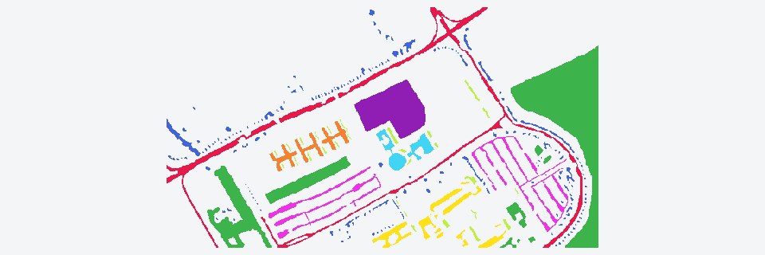
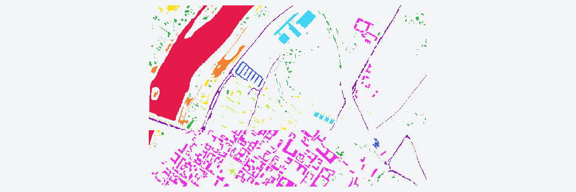
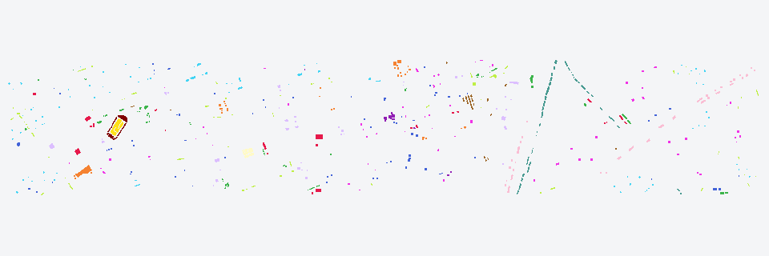
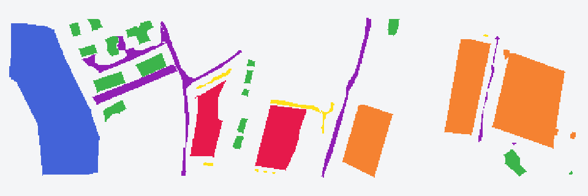
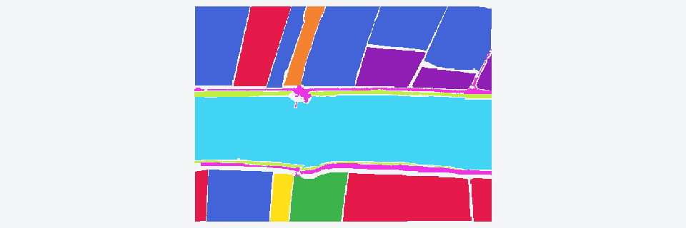
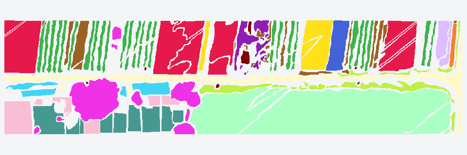
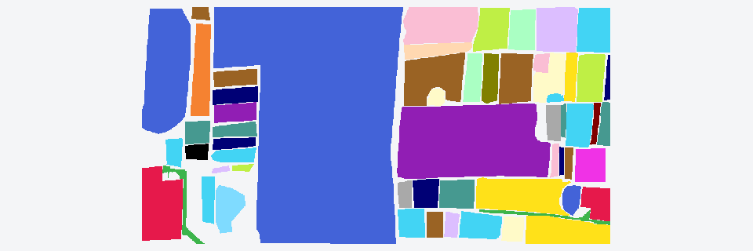
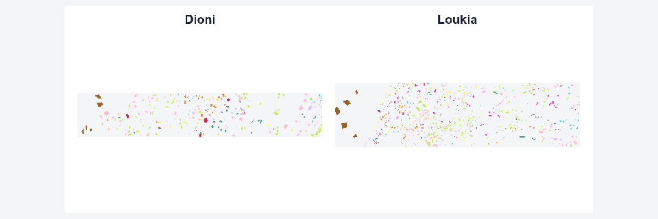
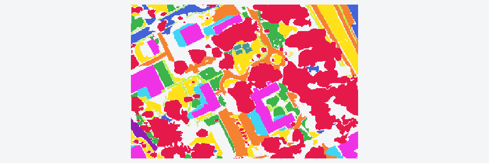
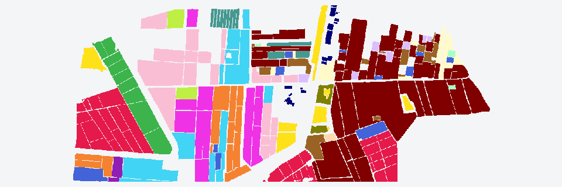

# Hyperspectral Image Datasets Collection

[English](en/README.md) · [数据来源与引用](SOURCES.md)

本仓库收录 15 个高光谱图像分类数据集。

## 下载

- [夸克网盘](https://pan.quark.cn/s/27a871c79b27)
- [Google Drive](https://drive.google.com/drive/folders/1xgSyrXw2NwzOUVaZ2BK1KBzgCDPKYC_n?usp=drive_link)

原始数据页和论文列在各数据集条目中。

## 数据集

### 1. 印度松树（Indian Pines）

- **采集**：1992 年 6 月 12 日，美国印第安纳州 Tippecanoe County 的 Indian Pine Test Site
- **传感器**：AVIRIS
- **数据**：145 × 145 像素，220 个原始波段；校正数据保留 200 个波段，空间分辨率 20 m
- **类别**：[16 类，10,249 个标注像素](data/Indian_Pines/Class_details.md)
- **来源**：[Purdue MultiSpec](https://engineering.purdue.edu/~biehl/MultiSpec/hyperspectral.html) · [PURR 数据记录](https://doi.org/10.4231/R7RX991C)

---

### 2. 帕维亚大学（Pavia University）

- **场景**：意大利北部帕维亚大学校园
- **传感器**：ROSIS
- **数据**：610 × 340 像素，103 个波段，空间分辨率 1.3 m
- **类别**：[9 类，42,776 个标注像素](data/Pavia/Class_details.md)
- **来源**：[UPV/EHU Hyperspectral Remote Sensing Scenes](https://www.ehu.eus/ccwintco/index.php/Hyperspectral_Remote_Sensing_Scenes)

---

### 3. 帕维亚中心（Pavia Centre）

- **场景**：意大利北部帕维亚市中心
- **传感器**：ROSIS
- **数据**：1096 × 715 像素，102 个波段，空间分辨率 1.3 m
- **类别**：[9 类，148,152 个标注像素](data/Pavia_Centre/Class_details.md)
- **来源**：[UPV/EHU Hyperspectral Remote Sensing Scenes](https://www.ehu.eus/ccwintco/index.php/Hyperspectral_Remote_Sensing_Scenes)

---

### 4. 萨利纳斯（Salinas）

- **场景**：美国加利福尼亚州 Salinas Valley 农业区
- **传感器**：AVIRIS
- **数据**：512 × 217 像素，224 个原始波段；去除吸水波段后保留 204 个波段，空间分辨率 3.7 m
- **类别**：[16 类，54,129 个标注像素](data/Salinas/Class_details.md)
- **来源**：[UPV/EHU 数据页](https://www.ehu.eus/ccwintco/index.php/Hyperspectral_Remote_Sensing_Scenes) · [NASA/JPL AVIRIS 1998 飞行索引](https://aviris.jpl.nasa.gov/ql/listla98.html)

---

### 5. 肯尼迪航天中心（Kennedy Space Center）

- **采集**：1996 年 3 月 23 日，美国佛罗里达州 Kennedy Space Center
- **传感器**：AVIRIS
- **数据**：512 × 614 像素，224 个原始波段；去除吸水和低信噪比波段后保留 176 个波段，空间分辨率 18 m
- **类别**：[13 类，5,211 个标注像素](data/KSC/Class_details.md)
- **来源**：[UPV/EHU Hyperspectral Remote Sensing Scenes](https://www.ehu.eus/ccwintco/index.php/Hyperspectral_Remote_Sensing_Scenes)

---

### 6. 博茨瓦纳（Botswana）

- **采集**：2001 年 5 月 31 日，博茨瓦纳 Okavango Delta
- **传感器**：EO-1 Hyperion
- **数据**：1476 × 256 像素，242 个原始波段；校正数据保留 145 个波段，空间分辨率 30 m
- **类别**：[14 类，3,248 个标注像素](data/Botswana/Class_details.md)
- **来源**：[UPV/EHU Hyperspectral Remote Sensing Scenes](https://www.ehu.eus/ccwintco/index.php/Hyperspectral_Remote_Sensing_Scenes)

---

### 7. 休斯顿 2013（Houston 2013）

- **采集**：LiDAR 于 2012 年 6 月 22 日采集，高光谱影像于 6 月 23 日采集；场景为 University of Houston 及邻近城区
- **传感器**：CASI 高光谱传感器和 LiDAR
- **数据**：1905 × 349 像素，144 个波段，空间分辨率 2.5 m
- **类别**：[15 类，15,029 个标注像素](data/Houston/Class_details.md)
- **来源与论文**：[IEEE GRSS 2013 Data Fusion Contest](https://www.grss-ieee.org/community/technical-committees/2013-ieee-grss-data-fusion-contest/) · [Debes et al., 2014](https://doi.org/10.1109/JSTARS.2014.2305441)

---

### 8. 特伦托（Trento）

- **场景**：意大利 Trento 以南的乡村地区
- **传感器**：AISA Eagle 高光谱传感器和 Optech ALTM 3100EA LiDAR
- **数据**：166 × 600 像素，63 个高光谱波段，空间分辨率 1 m
- **类别**：[6 类，30,214 个标注像素](data/Trento/Class_details.md)
- **来源与论文**：[University of Trento RSLab](https://rslab.disi.unitn.it/) · [Ghamisi, Höfle, and Zhu, 2017](https://doi.org/10.1109/JSTARS.2016.2634863) · [社区下载镜像](https://github.com/tyust-dayu/Trento)

---

### 9. WHU-Hi-LongKou

- **采集**：2018 年 7 月 17 日 13:49–14:37，中国湖北省龙口镇
- **平台与传感器**：DJI M600 Pro 无人机搭载 Headwall Nano-Hyperspec
- **数据**：550 × 400 像素，270 个波段，空间分辨率 0.463 m
- **类别**：[9 类，204,542 个标注像素](data/WHU-Hi-LongKou/Class_details.md)
- **来源与论文**：[武汉大学 RSIDEA](https://rsidea.whu.edu.cn/e-resource_WHUHi_sharing.htm) · [Zhong et al., 2020](https://doi.org/10.1016/j.rse.2020.112012)

---

### 10. WHU-Hi-HanChuan

- **采集**：2016 年 6 月 17 日 17:57–18:46，中国湖北省汉川市
- **平台与传感器**：Leica Aibot X6 无人机搭载 Headwall Nano-Hyperspec
- **数据**：1217 × 303 像素，274 个波段，空间分辨率 0.109 m
- **类别**：[16 类，257,530 个标注像素](data/WHU-Hi-HanChuan/Class_details.md)
- **来源与论文**：[武汉大学 RSIDEA](https://rsidea.whu.edu.cn/e-resource_WHUHi_sharing.htm) · [Zhong et al., 2020](https://doi.org/10.1016/j.rse.2020.112012)

---

### 11. WHU-Hi-HongHu

- **采集**：2017 年 11 月 20 日 16:23–17:37，中国湖北省洪湖市
- **平台与传感器**：DJI M600 Pro 无人机搭载 Headwall Nano-Hyperspec
- **数据**：940 × 475 像素，270 个波段，空间分辨率 0.043 m
- **类别**：[22 类，386,693 个标注像素](data/WHU-Hi-HongHu/Class_details.md)
- **来源与论文**：[武汉大学 RSIDEA](https://rsidea.whu.edu.cn/e-resource_WHUHi_sharing.htm) · [Zhong et al., 2020](https://doi.org/10.1016/j.rse.2020.112012)

---

### 12. 筑西（Chikusei）

- **采集**：2014 年 7 月 29 日 09:56–10:53（UTC+9），日本茨城县筑西市
- **传感器**：Headwall Hyperspec-VNIR-C
- **数据**：2517 × 2335 像素，128 个波段，波长范围 363–1018 nm，空间分辨率 2.5 m
- **类别**：[19 类，77,592 个标注像素](data/Chikusei/Class_details.md)
- **来源与引用**：[Naoto Yokoya 数据页](https://naotoyokoya.com/Download.html) · N. Yokoya and A. Iwasaki, “Airborne hyperspectral data over Chikusei,” SAL-2016-05-27, 2016

---

### 13. HyRANK

- **场景**：Dioni、Loukia、Erato、Kirki 和 Nefeli
- **传感器**：EO-1 Hyperion
- **数据**：每景 176 个波段，空间分辨率 30 m；Dioni 为 250 × 1376 像素，Loukia 为 249 × 945 像素
- **类别**：[Dioni 为 12 类、20,024 个标注像素；Loukia 为 14 类、13,503 个标注像素](data/HyRANK/Class_details.md)
- **来源与论文**：[HyRANK 数据记录](https://doi.org/10.5281/zenodo.1222202) · [ISPRS 项目报告](https://www.isprs.org/society/si/SI-2017/ISPRS-SI2017-TC3_WG4_Karantzalos_Report.pdf)

---

### 14. MUUFL Gulfport

- **采集**：2010 年 11 月 8 日，美国密西西比州 Long Beach 的 University of Southern Mississippi Gulf Park campus
- **传感器**：CASI-1500 高光谱传感器和 Gemini LiDAR
- **数据**：Campus 1 下采样版本为 325 × 220 像素、64 个波段、空间分辨率 1 m；原始采集为 72 个波段、0.5 m
- **类别**：[11 类，53,687 个标注像素](data/MUUFL_Gulfport/Class_details.md)
- **来源与论文**：[GatorSense / University of Florida](https://github.com/GatorSense/MUUFLGulfport) · [REP-2013-570](https://github.com/GatorSense/MUUFLGulfport/blob/master/MUUFLGulfportDataCollection/MUUFLGulfportTechReport.pdf) · [场景标签报告](https://ufdc.ufl.edu/IR00009711/00001)

---

### 15. 雄安（Xiongan）

- **采集**：2017 年 10 月 3 日 15:40–16:03，中国河北省雄安新区马蹄湾村
- **传感器**：AMMIS VNIR
- **数据**：1580 × 3750 像素，空间分辨率 0.5 m；官方数据记录为 250 个有效波段，下载文件头为 256 个原始波段
- **类别**：[Groundtruth 为 19 类、3,341,881 个标注像素；Farm_roi 为 20 类、3,677,110 个标注像素](data/Xiongan/Class_details.md)
- **来源与论文**：[官方数据记录](https://doi.org/10.3974/geodb.2021.01.02.V1) · [岑奕等，2020](https://doi.org/10.11834/jrs.20209065)

