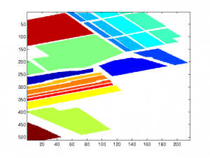
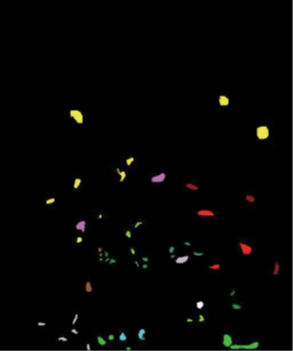
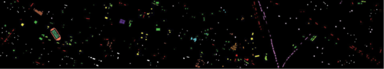

# Hyperspectral_Image_Datasets_Collection

## 选择语言
- [中文](#中文)
- [English](en/README.md)

## 中文

### 介绍
本仓库包含本人在研究生期间常用的高光谱图像数据集，。数据集也可以在百度网盘上获取。

### 下载链接
- **百度网盘**: [全部数据连接](https://pan.baidu.com/s/13Bd_8vZT9pIfqbTxNYlyEw?pwd=v81w)

### 数据集
#### 1. 印度松树（IP）数据集
- **数据采集时间**: 1992年
- **原始链接**: [Indian Pines Dataset](http://www.ehu.eus/ccwintco/index.php?title=Hyperspectral_Remote_Sensing_Scenes#Indian_Pines)
- **描述**: 印度松树数据集是一个常用于高光谱图像处理的基准数据集，包含来自印第安纳州普渡大学实验农场的224个波段的高光谱图像。
- **像素大小**: 145 x 145
- **波段数**: 224(原始)/200(去除吸水波段)
- **类别总数**：[16](data/Indian_Pines/Class_details.md)
- **GT(标签) 图像**

---

#### 2. 帕维亚大学（PU）数据集
- **数据采集时间**: 2001年
- **原始链接**: [Pavia University Dataset](http://www.ehu.eus/ccwintco/index.php?title=Hyperspectral_Remote_Sensing_Scenes#Pavia_Centre_and_University)
- **描述**: ROSIS传感器在意大利北部帕维亚上空飞行时拍摄的两个场景。
- **像素大小**: 610 x 610(大学)/610 x 340(去除黑色像素)
- **波段数**: 103
- **类别总数**：[9](data/Pavia/Class_details.md)
- **GT 图像**: 

---

#### 3. 萨利纳斯（Salinas）数据集
- **数据采集时间**: 未知
- **原始链接**: [Salinas Dataset](http://www.ehu.eus/ccwintco/index.php?title=Hyperspectral_Remote_Sensing_Scenes#Salinas_scene)
- **描述**: 萨利纳斯数据集是一个高光谱图像处理的基准数据集，包含来自美国加利福尼亚州萨利纳斯谷的224个波段的高光谱图像。
- **像素大小**: 512 x 217
- **波段数**: 224(全部)/204(去除吸水波段)
- **类别总数**：[16](data/Salinas/Class_details.md)
- **GT(标签) 图像**:

---

#### 4. 肯尼迪航天中心（KSC）数据集
- **数据采集时间**: 1996年3月23日
- **原始链接**: [KSC Dataset](https://www.ehu.eus/ccwintco/index.php?title=Hyperspectral_Remote_Sensing_Scenes#Kennedy_Space_Center_.28KSC.29)
- **描述**: NASA 的 AVIRIS (Airborne Visible/Infrared Imaging Spectrometer) 仪器于1996年3月23日在佛罗里达州的肯尼迪航天中心（KSC）上空获取了数据。AVIRIS 在400 - 2500 nm范围内的224个波段中获取数据，每个波段宽度为10 nm。KSC 数据从约20公里的高度获取，空间分辨率为18米。去除水吸收和低信噪比波段后，使用了176个波段进行分析。
- **像素大小**: 512 x 614
- **波段数**: 224(原始)/176(去除水吸收和低信噪比波段)
- **类别总数**：[13](data/KSC/Class_details.md)
- **GT(标签) 图像**:

---

#### 5. 博茨瓦纳（Botswana）数据集
- **数据采集时间**: 2001-2004年
- **原始链接**: [Botswana Dataset](https://www.ehu.eus/ccwintco/index.php?title=Hyperspectral_Remote_Sensing_Scenes#Botswana)
- **描述**: NASA 的 EO-1 卫星于2001年至2004年间在博茨瓦纳的奥卡万戈三角洲上空获取了一系列数据。EO-1 上的 Hyperion 传感器在30米像素分辨率下获取数据，覆盖7.7公里宽的条带，波段范围为400-2500 nm，每个波段宽度为10 nm。德克萨斯大学空间研究中心对数据进行了预处理，以减轻坏探测器、探测器间校准误差和间歇性异常的影响。未校准和噪声较大的覆盖水吸收特征的波段被去除，剩余的145个波段被用作候选特征。
- **像素大小**: 1476 x 256
- **波段数**: 242(原始)/145(去除水吸收和低信噪比波段)
- **类别总数**：[14](data/Botswana/Class_details.md)
- **GT(标签) 图像**:

---

#### 6. 休斯顿（Houston）数据集
- **数据采集时间**: 2013年
- **原始链接**: [Houston Dataset](https://hyperspectral.ee.uh.edu/?page_id=459)
- **描述**: 休斯顿数据集用于IEEE GRSS数据融合竞赛，包含休斯顿市区的高光谱图像和相应的地面真实标签。数据采集时间为2013年，共有144个波段。
- **像素大小**: 349 x 1905
- **波段数**: 144
- **类别总数**：[15](data/Houston/Class_details.md)
- **GT(标签) 图像**:

