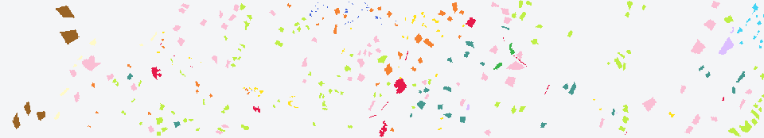
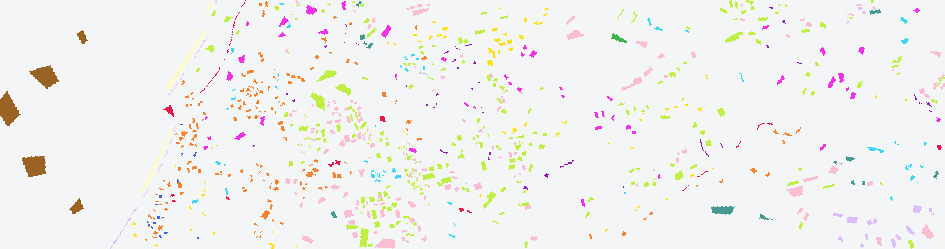

# HyRANK — class statistics

> Source: [HyRANK Hyperspectral Satellite Dataset I](https://doi.org/10.5281/zenodo.1222202). Counts were computed from Dioni_GT.tif and Loukia_GT.tif; label 0 is excluded. A zero means that the taxonomy class is absent from that reference map.

| ID | Source class name | Dioni | Loukia |
|---:|---|---:|---:|
| 1 | Dense Urban Fabric | 1,262 | 288 |
| 2 | Mineral Extraction Sites | 204 | 67 |
| 3 | Non-Irrigated Arable Land | 614 | 542 |
| 4 | Fruit Trees | 150 | 79 |
| 5 | Olive Groves | 1,768 | 1,401 |
| 6 | Broad-leaved Forest | 0 | 223 |
| 7 | Coniferous Forest | 361 | 500 |
| 8 | Mixed Forest | 0 | 1,072 |
| 9 | Dense Sclerophyllous Vegetation | 5,035 | 3,793 |
| 10 | Sparse Sclerophyllous Vegetation | 6,374 | 2,803 |
| 11 | Sparsely Vegetated Areas | 1,754 | 404 |
| 12 | Rocks and Sand | 492 | 487 |
| 13 | Water | 1,612 | 1,393 |
| 14 | Coastal Water | 398 | 451 |
|  | **Total** | **20,024** | **13,503** |

