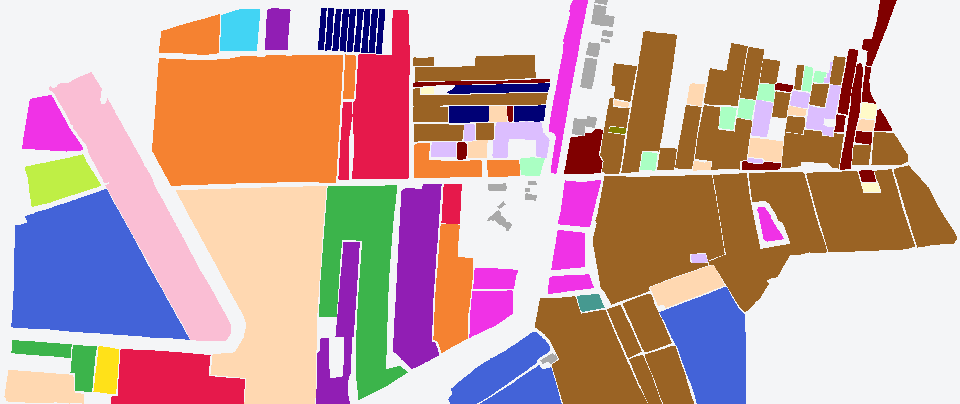

# Xiongan (Matiwan Village) — class statistics

> Source: [Global Change Research Data Publishing & Repository](https://doi.org/10.3974/geodb.2021.01.02.V1). The downloaded package contains two 1-byte ENVI classification rasters. Counts below were computed directly from those files; class 0 is excluded.

## Groundtruth.img

The ENVI header declares 19 labeled classes plus Unclassified.

| ID | Class name in header | Labeled pixels |
|---:|---|---:|
| 1 | Rice | 426,138 |
| 2 | Rice Stubble | 187,425 |
| 3 | Waters | 124,862 |
| 4 | Grassland | 91,518 |
| 5 | Willow | 197,218 |
| 6 | Elm | 19,663 |
| 7 | Acer Negundo | 296,538 |
| 8 | White Wax | 276,755 |
| 9 | Koelreuteria Paniculata | 44,232 |
| 10 | Chinese scholar tree | 372,708 |
| 11 | Peach | 67,210 |
| 12 | Vegetable Field | 29,763 |
| 13 | Corn | 85,547 |
| 14 | Poplar | 68,885 |
| 15 | Pear Tree | 986,139 |
| 16 | Soybean | 7,456 |
| 17 | Lotus leaf | 27,178 |
| 18 | Locust | 6,506 |
| 19 | House | 26,140 |
|  | **Total** | **3,341,881** |

## Farm_roi.img

The ENVI header declares 20 labeled classes plus Unclassified.

| ID | Class name in header | Labeled pixels |
|---:|---|---:|
| 1 | Acer Negundo | 225,647 |
| 2 | Willow | 180,766 |
| 3 | Elm | 15,353 |
| 4 | Rice | 452,144 |
| 5 | Sophora japonica | 475,591 |
| 6 | White Wax | 169,342 |
| 7 | Koelreuteria Paniculata | 23,304 |
| 8 | Waters | 165,647 |
| 9 | Naked Land | 38,409 |
| 10 | Rice Stubble | 193,830 |
| 11 | Locust | 5,612 |
| 12 | Corn | 59,165 |
| 13 | Pear Tree | 1,026,513 |
| 14 | Soybean | 7,151 |
| 15 | Poplar | 91,072 |
| 16 | Vegetable Field | 29,148 |
| 17 | Sparse Forest | 1,496 |
| 18 | Grassland | 421,790 |
| 19 | Peach | 65,514 |
| 20 | House | 29,616 |
|  | **Total** | **3,677,110** |

