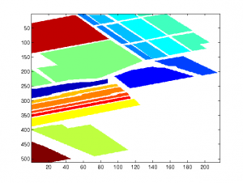
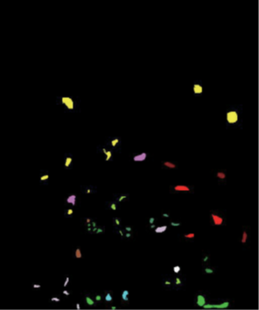
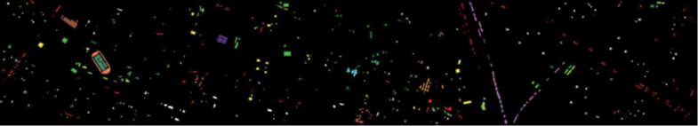

# Hyperspectral Image Datasets Collection

### Introduction
This repository contains commonly used hyperspectral image datasets used during my graduate studies. The datasets are also available on Baidu Netdisk and Quark Netdisk.

### Download Links
- **Baidu Netdisk**: [(https://pan.baidu.com/s/13Bd_8vZT9pIfqbTxNYlyEw?pwd=v81w)]

### Datasets
#### 1. Indian Pines (IP) Dataset
- **Data Collection Time**: 1992
- **Original Link**: [Indian Pines Dataset](http://www.ehu.eus/ccwintco/index.php?title=Hyperspectral_Remote_Sensing_Scenes#Indian_Pines)
- **Description**: The Indian Pines dataset is a commonly used benchmark in hyperspectral image processing, containing 224-band hyperspectral images from Purdue University's agricultural site in Indiana. It is used to test the performance of classification algorithms.
- **Pixel Size**: 145 x 145
- **Number of Bands**: 224(origional)/200 (corrected:After removing the bands covering the region of water absorption)
- **Class number**：[16](../data/Indian_Pines/Class_details.md)
- **GT(label) image**

---

#### 2. Pavia University (PU) Dataset
- **Data Collection Time**: 2001
- **Original Link**: [Pavia University Dataset](http://www.ehu.eus/ccwintco/index.php?title=Hyperspectral_Remote_Sensing_Scenes#Pavia_Centre_and_University)
- **Description**: These are two scenes acquired by the ROSIS sensor during a flight campaign over Pavia, nothern Italy》
- **Pixel Size**: 610 x 610(University)/610 x 340(Exclude backgroungd pixel)
- **Number of Bands**: 103
- **Class number**：[9](data/Pavia/Class_details.md)
- **GT igame**:

---

### 3. Salinas Dataset
- **Data Collection Time**: Unknown
- **Original Link**: [Salinas Dataset](http://www.ehu.eus/ccwintco/index.php?title=Hyperspectral_Remote_Sensing_Scenes#Salinas_scene)
- **Description**: This scene was collected by the 224-band AVIRIS sensor over Salinas Valley, California, and is characterized by high spatial resolution (3.7-meter pixels). The area covered comprises 512 lines by 217 samples.
- **Pixel Size**: 512 x 217
- **Number of Bands**: 224(Total)/204(Exclude water absorption bands)
- **Number of Classes**: [16](../data/Salinas/Class_details.md)
- **GT (Label) Image**:

---

#### 4. Kennedy Space Center (KSC) Dataset
- **Data Collection Time**: March 23, 1996
- **Original Link**: [KSC Dataset](https://www.ehu.eus/ccwintco/index.php?title=Hyperspectral_Remote_Sensing_Scenes#Kennedy_Space_Center_.28KSC.29)
- **Description**: The NASA AVIRIS (Airborne Visible/Infrared Imaging Spectrometer) instrument acquired data over the Kennedy Space Center (KSC), Florida, on March 23, 1996. AVIRIS acquires data in 224 bands of 10 nm width with center wavelengths from 400 - 2500 nm. The KSC data, acquired from an altitude of approximately 20 km, have a spatial resolution of 18 m. After removing water absorption and low SNR bands, 176 bands were used for the analysis.
- **Pixel Size**: 512 x 614
- **Number of Bands**: 224 (original)/176 (excluding water absorption and low SNR bands)
- **Number of Classes**: [13](../data/KSC/Class_details.md)
- **GT (Label) Image**:

---

#### 5. Botswana Dataset
- **Data Collection Time**: 2001-2004
- **Original Link**: [Botswana Dataset](https://www.ehu.eus/ccwintco/index.php?title=Hyperspectral_Remote_Sensing_Scenes#Botswana)
- **Description**: The NASA EO-1 satellite acquired a sequence of data over the Okavango Delta, Botswana in 2001-2004. The Hyperion sensor on EO-1 acquires data at 30 m pixel resolution over a 7.7 km strip in 242 bands covering the 400-2500 nm portion of the spectrum in 10 nm windows. Preprocessing of the data was performed by the UT Center for Space Research to mitigate the effects of bad detectors, inter-detector miscalibration, and intermittent anomalies. Uncalibrated and noisy bands that cover water absorption features were removed, and the remaining 145 bands were included as candidate features.
- **Pixel Size**: 1476 x 256
- **Number of Bands**: 242 (original)/145 (excluding water absorption and low SNR bands)
- **Number of Classes**: [14](../data/Botswana/Class_details.md)
- **GT (Label) Image**:

---

#### 6. Houston Dataset
- **Data Collection Time**: 2013
- **Original Link**: [Houston Dataset](https://hyperspectral.ee.uh.edu/?page_id=459)
- **Description**: The Houston dataset was used in the IEEE GRSS Data Fusion Contest, containing hyperspectral images and corresponding ground truth labels from the urban area of Houston, Texas. The data was collected in 2013 and consists of 144 bands.
- **Pixel Size**: 349 x 1905
- **Number of Bands**: 144
- **Number of Classes**: [15](../data/Houston/Class_details.md)
- **GT (Label) Image**:

