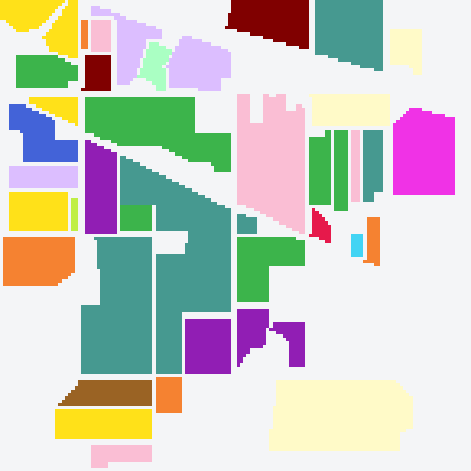
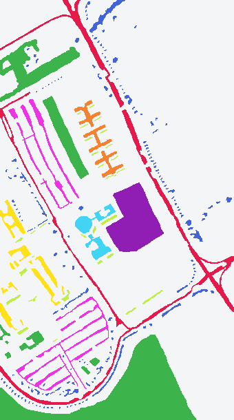
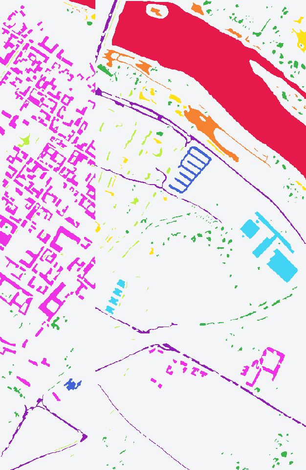
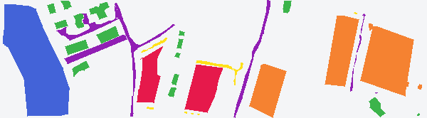
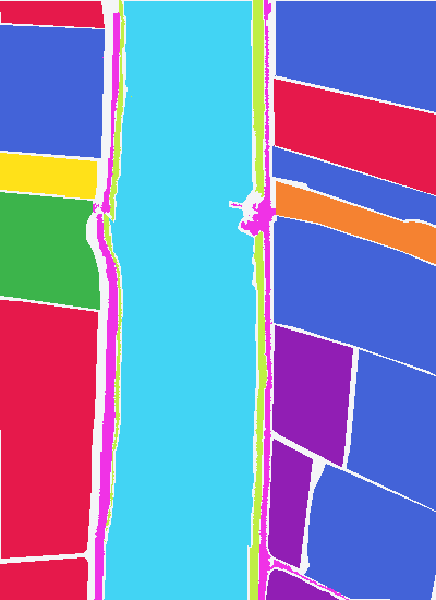
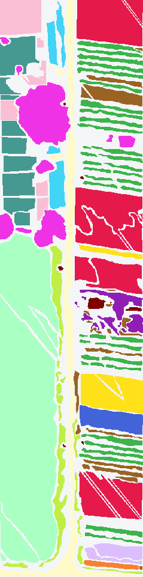

# Hyperspectral Image Datasets Collection

### Introduction
This repository contains commonly used hyperspectral image datasets used during my graduate studies. The datasets are also available on Baidu Netdisk and Quark Netdisk.

### Download Links
- **Quark Netdisk**: [All data](https://pan.quark.cn/s/855e6102f57c)
- **Google Drive**: [All data](https://drive.google.com/drive/folders/1xgSyrXw2NwzOUVaZ2BK1KBzgCDPKYC_n?usp=drive_link)

## Datasets

#### 1. Indian Pines
- **Acquisition Date**: 1992  
- **Original Link**: [Indian Pines Dataset](http://www.ehu.eus/ccwintco/index.php?title=Hyperspectral_Remote_Sensing_Scenes#Indian_Pines)  
- **Description**: A benchmark hyperspectral image dataset captured over agricultural fields at Purdue University, Indiana, containing 224 bands.  
- **Image Size**: 145 × 145  
- **Bands**: 224 (original) / 200 (after removing water absorption bands)  
- **Classes**: [16](../data/Indian_Pines/Class_details.md)  
- **GT Image**  
  

#### 2. Pavia University
- **Acquisition Date**: 2001  
- **Original Link**: [Pavia University Dataset](http://www.ehu.eus/ccwintco/index.php?title=Hyperspectral_Remote_Sensing_Scenes#Pavia_Centre_and_University)  
- **Description**: One of two ROSIS sensor scenes captured over northern Italy, covering the university campus.  
- **Image Size**: 610 × 610 (campus) / 610 × 340 (after removing dark pixels)  
- **Bands**: 103  
- **Classes**: [9](../data/Pavia/Class_details.md)  
- **GT Image**  
  

#### 3. Pavia Centre
- **Acquisition Date**: Unknown  
- **Original Link**: [Pavia Centre Dataset](http://www.ehu.eus/ccwintco/index.php?title=Hyperspectral_Remote_Sensing_Scenes#Pavia_Centre_and_University)  
- **Description**: ROSIS sensor scene over the city center of Pavia, Italy.  
- **Image Size**: 1096 × 1096  
- **Bands**: 102  
- **Classes**: [9](../data/Pavia_Centre/Class_details.md)  
- **GT Image**  
  

#### 4. Salinas
- **Acquisition Date**: Unknown  
- **Original Link**: [Salinas Dataset](http://www.ehu.eus/ccwintco/index.php?title=Hyperspectral_Remote_Sensing_Scenes#Salinas_scene)  
- **Description**: A benchmark dataset from Salinas Valley, California, with 224 spectral bands.  
- **Image Size**: 512 × 217  
- **Bands**: 224 (all) / 204 (after removing water absorption bands)  
- **Classes**: [16](../data/Salinas/Class_details.md)  
- **GT Image**  
  

#### 5. Kennedy Space Center (KSC)
- **Acquisition Date**: March 23, 1996  
- **Original Link**: [KSC Dataset](https://www.ehu.eus/ccwintco/index.php?title=Hyperspectral_Remote_Sensing_Scenes#Kennedy_Space_Center_.28KSC.29)  
- **Description**: NASA AVIRIS data captured over Kennedy Space Center, Florida; originally 224 bands, reduced to 176 after removal.  
- **Image Size**: 512 × 614  
- **Bands**: 224 (original) / 176 (after removing water absorption & low SNR bands)  
- **Classes**: [13](../data/KSC/Class_details.md)  
- **GT Image**  
  

#### 6. Botswana
- **Acquisition Date**: 2001–2004  
- **Original Link**: [Botswana Dataset](https://www.ehu.eus/ccwintco/index.php?title=Hyperspectral_Remote_Sensing_Scenes#Botswana)  
- **Description**: NASA EO-1 Hyperion data over the Okavango Delta; originally 242 bands, reduced to 145.  
- **Image Size**: 1476 × 256  
- **Bands**: 242 (original) / 145 (after removing water absorption & low SNR bands)  
- **Classes**: [14](../data/Botswana/Class_details.md)  
- **GT Image**  
  

#### 7. Houston
- **Acquisition Date**: 2013  
- **Original Link**: [Houston Dataset](https://hyperspectral.ee.uh.edu/?page_id=459)  
- **Description**: Hyperspectral imagery from the IEEE GRSS Data Fusion Contest, 144 bands.  
- **Image Size**: 349 × 1905  
- **Bands**: 144  
- **Classes**: [15](../data/Houston/Class_details.md)  
- **GT Image**  
  

#### 8. Trento
- **Acquisition Date**: Unknown  
- **Original Link**: [Trento Dataset](https://github.com/tyust-dayu/Trento)  
- **Description**: Multi-source dataset over Trento, Italy, with hyperspectral (63 bands) and LiDAR data at 1 m resolution.  
- **Image Size**: 166 × 600  
- **Bands**: 63  
- **Classes**: [6](../data/Trento/Class_details.md)  
- **GT Image**  
  

#### 9. WHU-Hi-LongKou
- **Acquisition Date**: July 17, 2018  
- **Original Data (.mat)**: http://rsidea.whu.edu.cn/code_data/WHU-Hi/Matlab_data_format/WHU-Hi-LongKou/WHU_Hi_LongKou.mat  
- **GT (.mat)**: http://rsidea.whu.edu.cn/code_data/WHU-Hi/Matlab_data_format/WHU-Hi-LongKou/WHU_Hi_LongKou_gt.mat  
- **Description**: UAV-mounted Headwall Nano-Hyperspec at 500 m over Longkou, Hubei; 270 bands, ~0.463 m resolution.  
- **Image Size**: 550 × 400  
- **Bands**: 270  
- **Classes**: [9](../data/WHU-Hi-LongKou/Class_details.md)  
- **GT Image**  
  

#### 10. WHU-Hi-HanChuan
- **Acquisition Date**: June 17, 2016 17:57–18:46  
- **Original Data (.mat)**: http://rsidea.whu.edu.cn/code_data/WHU-Hi/Matlab_data_format/WHU-Hi-HanChuan/WHU_Hi_HanChuan.mat  
- **GT (.mat)**: http://rsidea.whu.edu.cn/code_data/WHU-Hi/Matlab_data_format/WHU-Hi-HanChuan/WHU_Hi_HanChuan_gt.mat  
- **Description**: UAV-mounted Headwall Nano-Hyperspec at 250 m over Hanchuan, Hubei; 274 bands, ~0.109 m resolution.  
- **Image Size**: 1217 × 303  
- **Bands**: 274  
- **Classes**: [13](../data/WHU-Hi-HanChuan/Class_details.md)  
- **GT Image**  
  

#### 11. WHU-Hi-HongHu
- **Acquisition Date**: November 20, 2017 16:23–17:37  
- **Original Data (.mat)**: http://rsidea.whu.edu.cn/code_data/WHU-Hi/Matlab_data_format/WHU-Hi-HongHu/WHU_Hi_HongHu.mat  
- **GT (.mat)**: http://rsidea.whu.edu.cn/code_data/WHU-Hi/Matlab_data_format/WHU-Hi-HongHu/WHU_Hi_HongHu_gt.mat  
- **Description**: UAV-mounted Headwall Nano-Hyperspec at 100 m over Honghu, Hubei; 270 bands, ~0.043 m resolution.  
- **Image Size**: 940 × 475  
- **Bands**: 270  
- **Classes**: [22](../data/WHU-Hi-HongHu/Class_details.md)  
- **GT Image**  
  