# Hyperspectral Image Datasets Collection

[中文](../README.md) · [Sources and citations](SOURCES.md)

This repository contains 15 hyperspectral image classification datasets.

## Downloads

- [Quark Drive](https://pan.quark.cn/s/27a871c79b27)
- [Google Drive](https://drive.google.com/drive/folders/1xgSyrXw2NwzOUVaZ2BK1KBzgCDPKYC_n?usp=sharing)

The primary data pages and papers are listed with each dataset.

## Datasets

### 1. Indian Pines

- **Acquisition:** 12 June 1992, Indian Pine Test Site, Tippecanoe County, Indiana, USA
- **Sensor:** AVIRIS
- **Data:** 145 × 145 pixels and 220 original bands; the corrected cube retains 200 bands; 20 m spatial resolution
- **Classes:** 16
- **Source:** [Purdue MultiSpec](https://engineering.purdue.edu/~biehl/MultiSpec/hyperspectral.html) · [PURR data record](https://doi.org/10.4231/R7RX991C)

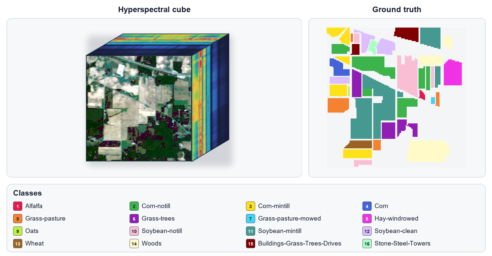

---

### 2. Pavia University

- **Scene:** University of Pavia campus, northern Italy
- **Sensor:** ROSIS
- **Data:** 610 × 340 pixels, 103 bands, 1.3 m spatial resolution
- **Classes:** 9
- **Source:** [UPV/EHU Hyperspectral Remote Sensing Scenes](https://www.ehu.eus/ccwintco/index.php/Hyperspectral_Remote_Sensing_Scenes)

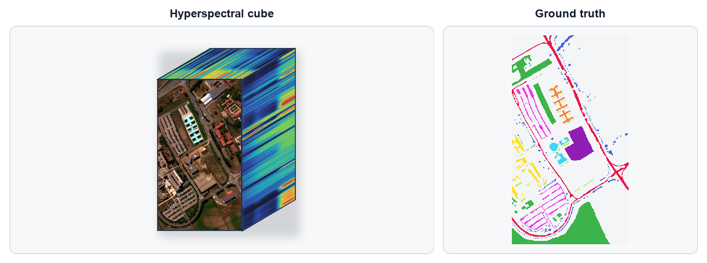

---

### 3. Pavia Centre

- **Scene:** Pavia city centre, northern Italy
- **Sensor:** ROSIS
- **Data:** 1096 × 715 pixels, 102 bands, 1.3 m spatial resolution
- **Classes:** 9
- **Source:** [UPV/EHU Hyperspectral Remote Sensing Scenes](https://www.ehu.eus/ccwintco/index.php/Hyperspectral_Remote_Sensing_Scenes)

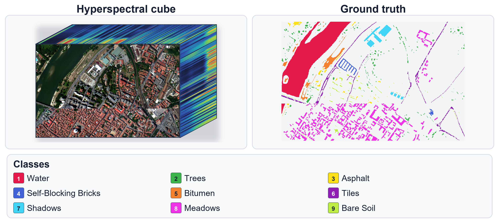

---

### 4. Salinas

- **Scene:** Agricultural area in Salinas Valley, California, USA
- **Sensor:** AVIRIS
- **Data:** 512 × 217 pixels and 224 original bands; 204 bands remain after water-absorption bands are removed; 3.7 m spatial resolution
- **Classes:** 16
- **Source:** [UPV/EHU data page](https://www.ehu.eus/ccwintco/index.php/Hyperspectral_Remote_Sensing_Scenes) · [NASA/JPL AVIRIS 1998 flight index](https://aviris.jpl.nasa.gov/ql/listla98.html)

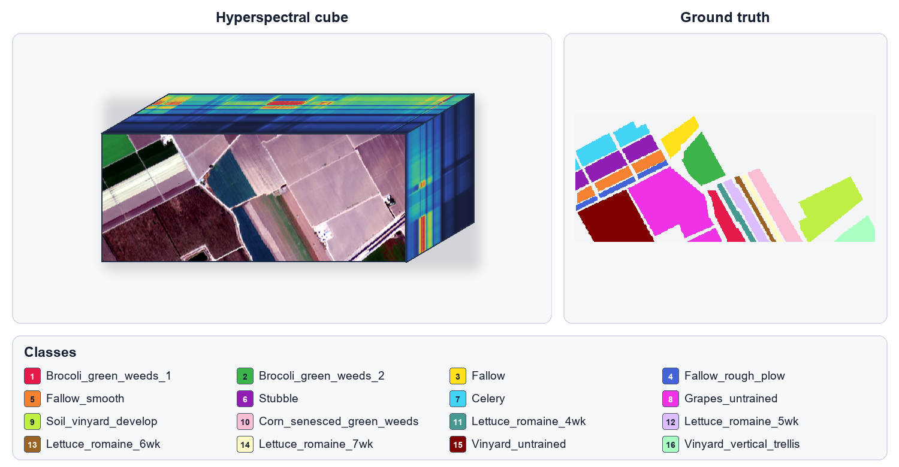

---

### 5. Kennedy Space Center

- **Acquisition:** 23 March 1996, Kennedy Space Center, Florida, USA
- **Sensor:** AVIRIS
- **Data:** 512 × 614 pixels and 224 original bands; 176 bands remain after water-absorption and low-SNR bands are removed; 18 m spatial resolution
- **Classes:** 13
- **Source:** [UPV/EHU Hyperspectral Remote Sensing Scenes](https://www.ehu.eus/ccwintco/index.php/Hyperspectral_Remote_Sensing_Scenes)

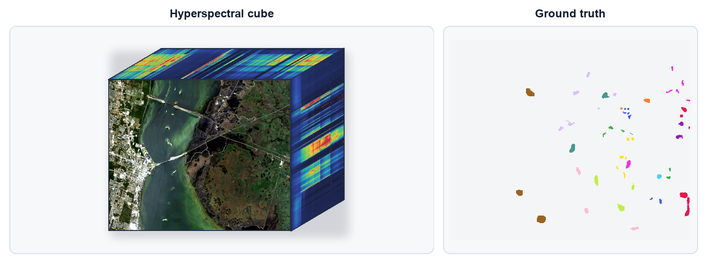

---

### 6. Botswana

- **Acquisition:** 31 May 2001, Okavango Delta, Botswana
- **Sensor:** EO-1 Hyperion
- **Data:** 1476 × 256 pixels and 242 original bands; the corrected data retain 145 bands; 30 m spatial resolution
- **Classes:** 14
- **Source:** [UPV/EHU Hyperspectral Remote Sensing Scenes](https://www.ehu.eus/ccwintco/index.php/Hyperspectral_Remote_Sensing_Scenes)

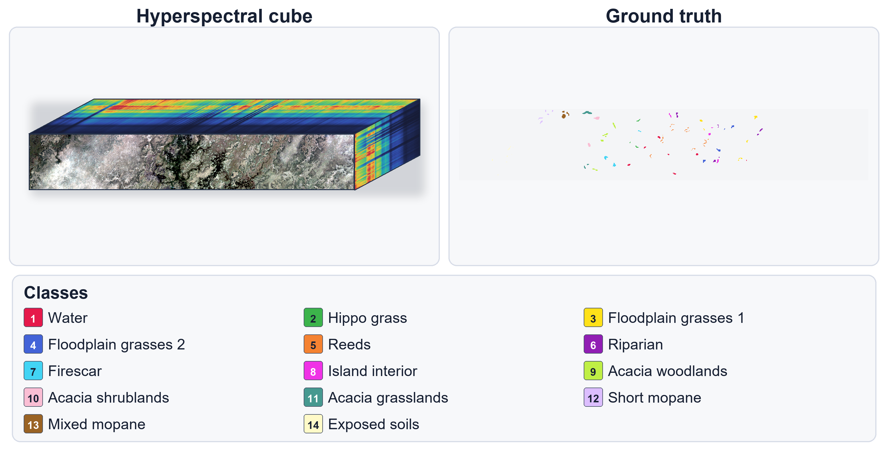

---

### 7. Houston 2013

- **Acquisition:** LiDAR on 22 June 2012 and hyperspectral imagery on 23 June 2012; University of Houston and the neighboring urban area
- **Sensors:** CASI hyperspectral sensor and LiDAR
- **Data:** 1905 × 349 pixels, 144 bands, 2.5 m spatial resolution
- **Classes:** 15
- **Source and paper:** [IEEE GRSS 2013 Data Fusion Contest](https://www.grss-ieee.org/community/technical-committees/2013-ieee-grss-data-fusion-contest/) · [Debes et al., 2014](https://doi.org/10.1109/JSTARS.2014.2305441)

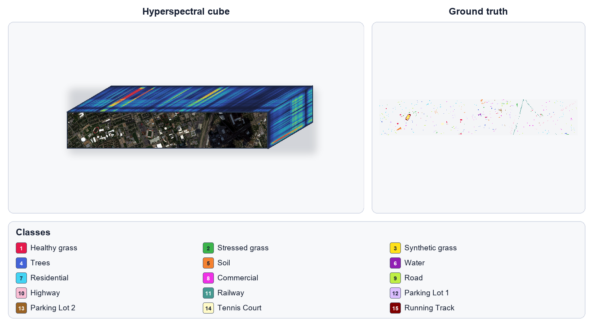

---

### 8. Trento

- **Scene:** Rural area south of Trento, Italy
- **Sensors:** AISA Eagle hyperspectral sensor and Optech ALTM 3100EA LiDAR
- **Data:** 166 × 600 pixels, 63 hyperspectral bands, 1 m spatial resolution
- **Classes:** 6
- **Source and paper:** [University of Trento RSLab](https://rslab.disi.unitn.it/) · [Ghamisi, Höfle, and Zhu, 2017](https://doi.org/10.1109/JSTARS.2016.2634863) · [community download mirror](https://github.com/tyust-dayu/Trento)

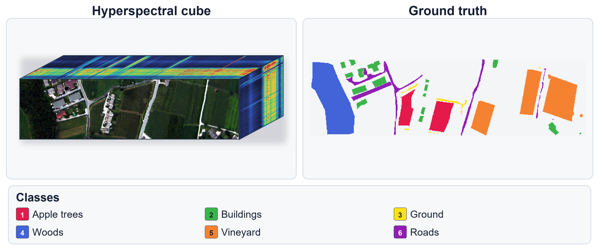

---

### 9. WHU-Hi-LongKou

- **Acquisition:** 17 July 2018, 13:49–14:37, Longkou Town, Hubei, China
- **Platform and sensor:** Headwall Nano-Hyperspec on a DJI M600 Pro UAV
- **Data:** 550 × 400 pixels, 270 bands, 0.463 m spatial resolution
- **Classes:** 9
- **Source and paper:** [Wuhan University RSIDEA](https://rsidea.whu.edu.cn/e-resource_WHUHi_sharing.htm) · [Zhong et al., 2020](https://doi.org/10.1016/j.rse.2020.112012)

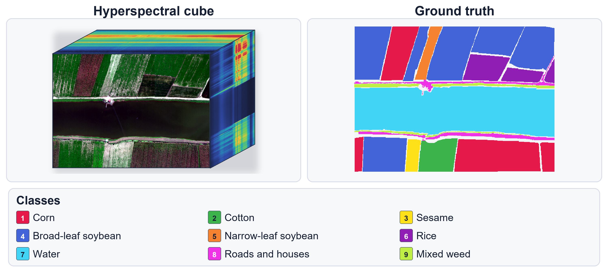

---

### 10. WHU-Hi-HanChuan

- **Acquisition:** 17 June 2016, 17:57–18:46, Hanchuan, Hubei, China
- **Platform and sensor:** Headwall Nano-Hyperspec on a Leica Aibot X6 UAV
- **Data:** 1217 × 303 pixels, 274 bands, 0.109 m spatial resolution
- **Classes:** 16
- **Source and paper:** [Wuhan University RSIDEA](https://rsidea.whu.edu.cn/e-resource_WHUHi_sharing.htm) · [Zhong et al., 2020](https://doi.org/10.1016/j.rse.2020.112012)

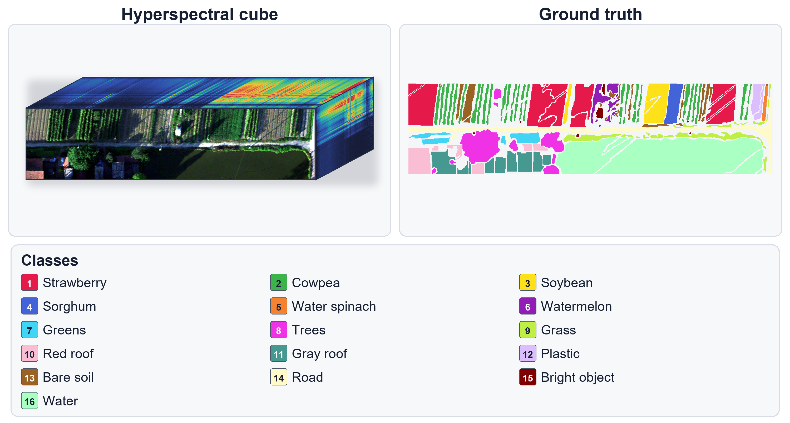

---

### 11. WHU-Hi-HongHu

- **Acquisition:** 20 November 2017, 16:23–17:37, Honghu City, Hubei, China
- **Platform and sensor:** Headwall Nano-Hyperspec on a DJI M600 Pro UAV
- **Data:** 940 × 475 pixels, 270 bands, 0.043 m spatial resolution
- **Classes:** 22
- **Source and paper:** [Wuhan University RSIDEA](https://rsidea.whu.edu.cn/e-resource_WHUHi_sharing.htm) · [Zhong et al., 2020](https://doi.org/10.1016/j.rse.2020.112012)

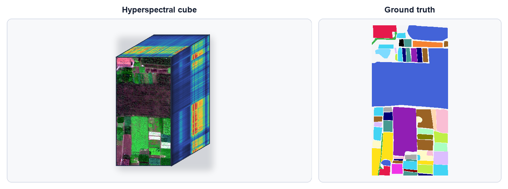

---

### 12. Chikusei

- **Acquisition:** 29 July 2014, 09:56–10:53 (UTC+9), Chikusei, Ibaraki, Japan
- **Sensor:** Headwall Hyperspec-VNIR-C
- **Data:** 2517 × 2335 pixels, 128 bands covering 363–1018 nm, 2.5 m spatial resolution
- **Classes:** 19
- **Source and citation:** [Naoto Yokoya data page](https://naotoyokoya.com/Download.html) · N. Yokoya and A. Iwasaki, “Airborne hyperspectral data over Chikusei,” SAL-2016-05-27, 2016

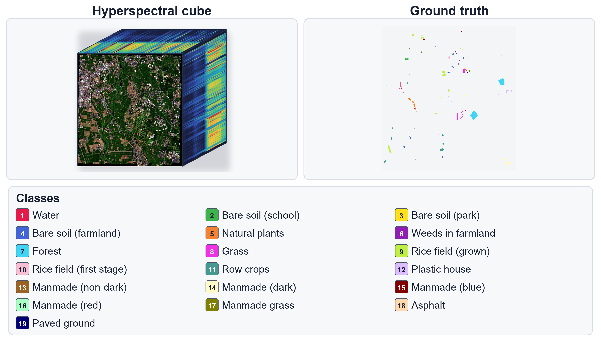

---

### 13. HyRANK

- **Scenes:** Dioni, Loukia, Erato, Kirki, and Nefeli
- **Sensor:** EO-1 Hyperion
- **Data:** 176 bands per scene and 30 m spatial resolution; Dioni is 250 × 1376 pixels and Loukia is 249 × 945 pixels
- **Classes:** 14-class taxonomy (12 classes occur in Dioni and all 14 occur in Loukia)
- **Source and paper:** [HyRANK data record](https://doi.org/10.5281/zenodo.1222202) · [ISPRS project report](https://www.isprs.org/society/si/SI-2017/ISPRS-SI2017-TC3_WG4_Karantzalos_Report.pdf)

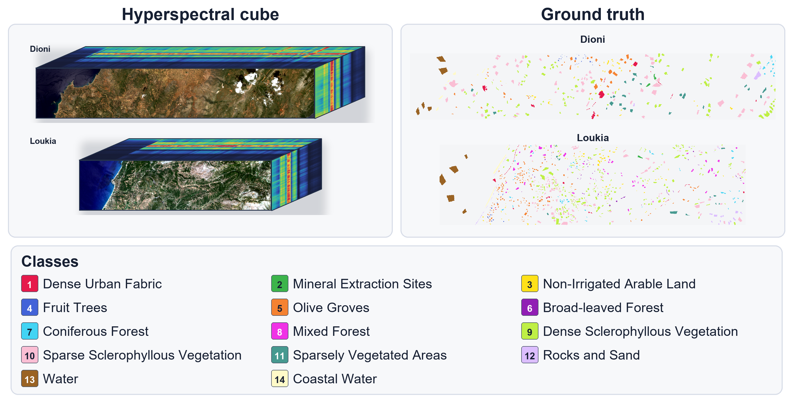

---

### 14. MUUFL Gulfport

- **Acquisition:** 8 November 2010, University of Southern Mississippi Gulf Park campus, Long Beach, Mississippi, USA
- **Sensors:** CASI-1500 hyperspectral sensor and Gemini LiDAR
- **Data:** the downsampled Campus 1 version is 325 × 220 pixels with 64 bands at 1 m; the original acquisition has 72 bands at 0.5 m
- **Classes:** 11
- **Source and papers:** [GatorSense / University of Florida](https://github.com/GatorSense/MUUFLGulfport) · [REP-2013-570](https://github.com/GatorSense/MUUFLGulfport/blob/master/MUUFLGulfportDataCollection/MUUFLGulfportTechReport.pdf) · [scene-label report](https://ufdc.ufl.edu/IR00009711/00001)

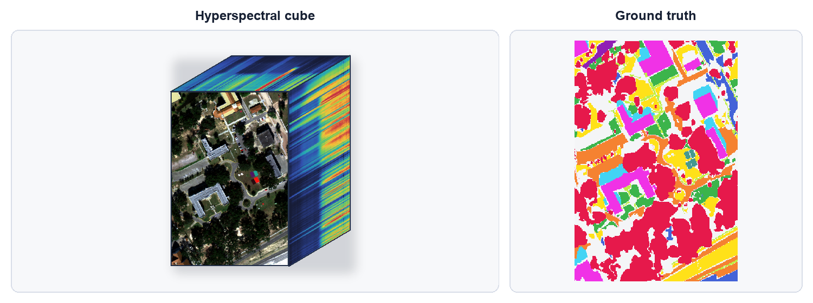

---

### 15. Xiongan

- **Acquisition:** 3 October 2017, 15:40–16:03, Matiwan Village, Xiongan New Area, Hebei, China
- **Sensor:** AMMIS VNIR
- **Data:** 1580 × 3750 pixels at 0.5 m; the official record states 250 effective bands and the distributed header states 256 original bands
- **Classes:** 19 in Groundtruth; 20 in Farm_roi
- **Source and paper:** [official data record](https://doi.org/10.3974/geodb.2021.01.02.V1) · [Cen et al., 2020](https://doi.org/10.11834/jrs.20209065)

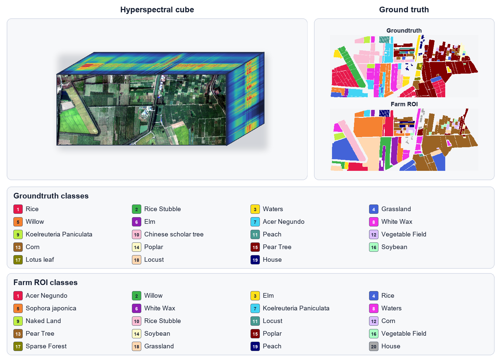
